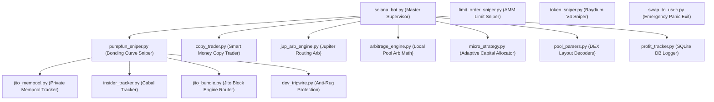

# Solana Trading & MEV Orchestration Suite
**Designed & Built by cook45 & clack // Systems & MEV**

A high-performance, asynchronous Solana trading infrastructure designed for multi-engine orchestration, real-time mempool sniping, copy trading, round-trip arbitrage, and micro-capital risk optimization.

---

## 1. Architectural Blueprint

The suite is engineered around a modular, flat-import architecture to maintain speed, raw transaction throughput, and ease of execution. The system features a centralized orchestration engine (`solana_bot.py`) that acts as a central supervisor, delegating capital and resources to independent sub-engines while low-level libraries handle Jito bundles, AMM parsing, and safety systems.



---

## 2. Directory & Module Index

### 核心引擎 / Core Supervisors
*   **`solana_bot.py`**
    *   **Function:** The central supervisor engine. Establishes the `CapitalAllocator` to partition funds across parallel activities, initializes WebSockets, runs the RPC multi-node failover loop, and coordinates active arbitrage and copy trading concurrently.

### 交易引擎 / Execution Engines
*   **`pumpfun_sniper.py`**
    *   **Function:** Sub-second concurrent sniper for pump.fun bonding curves. Spawns dedicated micro-monitors (`asyncio.create_task`) per position for trailing stop-loss, monitors sell pressure, and executes emergency Jito exit escalations.
*   **`copy_trader.py`**
    *   **Function:** Real-time wallet mirroring engine. Listens to Helius WebSockets for target account transactions, parses inner instructions to extract DEX swaps, and instantly replicates buys/sells.
*   **`jup_arb_engine.py`**
    *   **Function:** Round-trip triangular arbitrage detector utilizing the Jupiter API. Aggregates pathways across 20+ Solana DEXes to extract guaranteed profit paths while maintaining strict Jupiter rate limiters.
*   **`arbitrage_engine.py`**
    *   **Function:** Low-level concentrated liquidity (Raydium CLMM, Orca Whirlpool) swap math. Handles square-root price tick crossing formulas locally to evaluate price anomalies.
*   **`micro_strategy.py`**
    *   **Function:** Adaptive capitalization management layer. Automatically checks SOL/USDC balances to assign capital tiers (`DUST`, `MICRO`, `LOW`, `MEDIUM`, `HIGH`) and applies dynamic profit floors and spike multipliers to prevent gas bleeding.
*   **`limit_order_sniper.py`**
    *   **Function:** Standalone limit order automation script that manages target token price thresholds and triggers micro-buy or micro-sell executions.
*   **`token_sniper.py`**
    *   **Function:** Legacy/standalone sniper that monitors Raydium AMM program logs (`675kPX...`) for new pool initializations to execute immediate micro-buys.

### 辅助与安全库 / Utilities & Safety Layers
*   **`pool_parsers.py`:** Low-level buffer layout decoders for parsing Raydium AMM V4, CLMM, SPL Token, and Orca Whirlpool account states.
*   **`profit_tracker.py`:** Database manager that records all completed trade metrics, token addresses, durations, and profits into a local SQLite repository (`trades.db`).
*   **`dev_tripwire.py`:** Active rug-pull sensor. Watches token creator wallets for supply movements or liquidity removal transactions and triggers instant emergency panic exits.
*   **`jito_bundle.py`:** Low-level Jito JSON-RPC block engine client. Constructs VersionedTransactions, applies tipping parameters, and submits bundles to bypass public mempools.
*   **`jito_mempool.py`:** Private mempool WebSocket parser designed to intercept Jito pending transactions before inclusion.
*   **`insider_tracker.py`:** Monitors insider holder actions to locate immediate consolidation pools.
*   **`swap_to_usdc.py`:** An emergency utility script to exit a specific token position or swap a target SOL amount straight to USDC via Jupiter.

---

## 3. Quickstart & Configuration

### Prerequisites
1.  Python 3.10+
2.  Install dependencies:
    ```bash
    pip install -r requirements.txt
    ```

### Environment Config (`.env`)
Create a `.env` file in the root directory:
```env
SOLANA_PRIVATE_KEY="[your,private,key,bytes]"
HELIUS_RPC_URL="https://mainnet.helius-rpc.com/?api-key=your-key"
HELIUS_WSS_URL="wss://mainnet.helius-rpc.com/?api-key=your-key"
JITO_BLOCK_ENGINE_URL="https://mainnet.block-engine.jito.wtf/api/v1/bundles"
JITO_UUID="your-jito-uuid-if-needed"
```

### Launch Blueprints
*   **Run the Complete Suite:**
    ```bash
    python solana_bot.py
    ```
*   **Run pump.fun Sniper Standalone:**
    ```bash
    python pumpfun_sniper.py
    ```
*   **Run Copy Trader Standalone:**
    ```bash
    python copy_trader.py
    ```
*   **Emergency Swap to USDC:**
    ```bash
    python swap_to_usdc.py --token [token_mint_address] --amount [amount_to_sell]
    ```

---

## 4. Operational Safety Regulations

1.  **Mempool Frontrun Protection:** Always keep Jito bundle tipping active (`jito_bundle.py`) during snipes to ensure transactions are executed atomically or not at all, eliminating frontrunning losses.
2.  **Slippage Escalation:** For emergency safety exits, the sub-monitors are designed to scale slippage to 100% and double priority fees. Do not disable these thresholds; they are the only shield protecting capital from fast-moving developer rug-pulls.
3.  **Local Testing:** Use simulated dry runs for new strategies by placing them in the [scratch/](file:///c:/Users/Sourav%20Biswas/Souravjr0/floating%20bot/scratch/) folder to keep runtime files clean.
